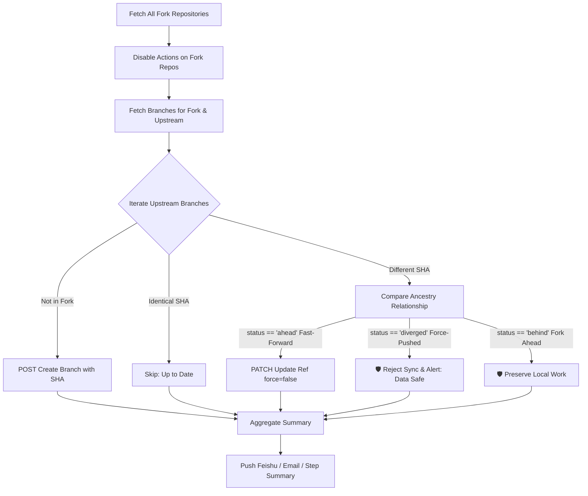

# GitHub Forks Auto Sync & Management (Full Scan / All Branches / Data Loss Prevention / Feishu & Email Notifications / i18n)

[English](README.en.md) | [简体中文](README.md)

Automatically synchronizes all branches of all forked repositories under your GitHub account (including upstream new branches), automatically disables GitHub Actions on forked repositories to prevent unwanted quota consumption, and sends notifications to **Feishu (Lark) Bot** and **Email (SMTP)** upon completion. Fully supports internationalization (i18n).

---

## ✨ Key Features

- 🔄 **Full Automated Scan**: Automatically scans **all** forked repositories under your account via pagination, without manual configuration of repository lists.
- 🌿 **All-Branch Synchronization**:
  - **New Upstream Branches**: Automatically creates identical branches in your fork repository to stay aligned with upstream.
  - **Existing Branch Updates**: Strictly enforces **Fast-Forward safety checks**, updating only when commits cleanly advance forward.
- 🛡️ **Data Loss Prevention**:
  - If the upstream repository undergoes a **Force Push / Hard Reset** or history rewrite, the system **automatically rejects synchronization and warns you**, never force-overwriting your repository!
  - If your fork contains independent local commits (Diverged / Ahead), synchronization is skipped to preserve your work.
  - Gracefully skips and logs if upstream repositories or branches are deleted (404/422).
- 🚫 **Auto-Disable GitHub Actions**: Automatically disables GitHub Actions at the repository level (`enabled: false`) for each fork, preventing CI/CD quota waste and unintended workflow triggers.
- 📨 **Multi-Channel Notification Push**:
  - **Feishu / Lark Bot**: Sends interactive cards with sync overview and issue details (signature verification supported).
  - **SMTP Email Notifications**: Supports QQ Mail, NetEase 163, Gmail, Outlook, Enterprise Mail, and any custom SMTP server with responsive HTML reports.
- 🌐 **Internationalization (i18n)**: Out-of-the-box support for English (`en`) and Chinese (`zh`) across console logs, Step Summary, Feishu cards, and Email notifications.
- 📊 **GitHub Actions Step Summary**: Generates a clean Markdown summary table directly in the GitHub Actions run summary page.
- ⚙️ **Whitelist / Blacklist Filtering**: Supports excluding repositories (`EXCLUDE_REPOS`) or syncing only specified repositories (`INCLUDE_ONLY`).

---

## 🚀 Quick Start Guide (Fork to Use Immediately)

### 🍴 How to Fork and Set Up (4 Easy Steps):

1. **Fork this repository**:
   - Click the **`Fork`** button in the upper right corner of this page to fork it to your GitHub account.
2. **Enable Actions in your Fork**:
   - In your newly forked repository, go to the **Actions** tab.
   - Click the green button **`I understand my workflows, go ahead and enable them`**.
3. **Configure Personal Access Token (PAT) Secret**:
   - Go to repository **Settings** -> **Secrets and variables** -> **Actions**.
   - Under **Repository secrets**, click **New repository secret**:
     - **Name**: `GH_PAT`
     - **Secret**: Paste your GitHub Personal Access Token (must include `repo` scope, see instructions below).
4. **Trigger Initial Run**:
   - Star ⭐ your forked repository, or go to the **Actions** tab and click **Run workflow** to start your first full synchronization immediately!

---

### 🔑 Detailed Configuration Steps

#### Step 1: Create GitHub Personal Access Token (PAT)

A PAT with appropriate permissions is required to scan repositories, update branches, and **manage repository Actions permissions**:

##### Recommended Option A: Tokens (classic) 👍
1. In GitHub, go to **Settings** -> **Developer Settings** -> **Personal access tokens** -> **Tokens (classic)**.
2. Click **Generate new token (classic)**.
3. **Expiration**: Choose `No expiration` for maintenance-free long-term execution.
4. **Scopes** (Check only the following 2 scopes):
   - ✅ **`repo`** (Grants access to private/public repositories, branch read/write, and repository Actions permission management)
   - ✅ **`workflow`** (Allows updating branches that contain `.github/workflows/` files)
5. Click **Generate token** and copy the token (e.g. `ghp_xxxx`).

##### Option B: Fine-grained tokens
If using Fine-grained tokens, grant the following **Repository permissions**:
- **Actions**: `Read and write`
- **Administration**: `Read and write`
- **Contents**: `Read and write`
- **Workflows**: `Read and write`

---

#### Step 2: Configure Repository Secrets / Variables

In your forked repository:
- **Add Secrets**: Go to **Settings** -> **Secrets and variables** -> **Actions** -> Click **New repository secret**.
- **Add Variables**: Under the same page, click **New repository variable** (for non-sensitive settings).

| Configuration Key | Type | Required | Default | Description |
| :--- | :--- | :--- | :--- | :--- |
| `GH_PAT` | Secret | **Required** | - | GitHub PAT generated in Step 1 (`repo` + `workflow` scopes) |
| `LANGUAGE` | Secret / Var | Optional | `zh` | UI & Notification language: `en` (English) or `zh` (Chinese) |
| `FEISHU_WEBHOOK_URL` | Secret | Optional | - | Feishu / Lark custom bot Webhook URL |
| `FEISHU_SECRET` | Secret | Optional | - | Feishu bot security signature secret (if enabled) |
| `SMTP_HOST` | Secret / Var | Optional | - | SMTP server host (e.g. `smtp.gmail.com`, `smtp.office365.com`, `smtp.qq.com`) |
| `SMTP_PORT` | Secret / Var | Optional | `465` / `587` | SMTP server port (465 for SSL, 587 for STARTTLS) |
| `SMTP_USER` | Secret / Var | Optional | - | Sender email address (e.g. `your_email@gmail.com`) |
| `SMTP_PASS` | Secret | Optional | - | Sender email password or App authorization password |
| `SMTP_TO` | Secret / Var | Optional | Same as `SMTP_USER` | Recipient email address(es) (comma-separated for multiple) |
| `SMTP_FROM_NAME` | Secret / Var | Optional | `GitHub Forks Auto` | Display sender name in email header |
| `DEBUG_MODE` | Secret / Var | Optional | `false` | Set to `true` to enable debug logs and public detail table in Actions summary |
| `DISABLE_ACTIONS` | Secret / Var | Optional | `true` | Automatically disable GitHub Actions on forked repositories |
| `EXCLUDE_REPOS` | Secret / Var | Optional | - | **Blacklist**: Repositories to exclude (e.g. `repo1,owner/repo2`) |
| `INCLUDE_ONLY` | Secret / Var | Optional | - | **Whitelist**: Only sync listed repositories, ignore all others |
| `MAX_RUNTIME_MINUTES` | Secret / Var | Optional | `320` | Maximum runtime threshold per job (minutes). Auto-dispatches relay job before timeout |

> *💡 Tip: When manually triggering **Run workflow**, you can select the language, enter whitelist/blacklist filters, or enable debug mode directly.*

##### 📝 Repository Format Rules (Whitelist & Blacklist):
- **Short or Full Names**: Supports both `my-repo` and `owner/my-repo` (case-insensitive).
- **Flexible Delimiters**: Supports commas, spaces, semicolons, and multi-line newlines.

---

### Step 3: Configure Notification Channels (Optional)

#### Option A: Feishu (Lark) Custom Bot
1. In your Feishu / Lark group chat, go to **Settings** -> **Bots** -> **Add Bot** -> **Custom Bot**.
2. Set a bot name (e.g., `GitHub Sync Bot`).
3. Copy the **Webhook URL** and paste it into GitHub Secret `FEISHU_WEBHOOK_URL`.
4. (Optional) Enable **Signature Verification** and paste the secret into `FEISHU_SECRET`.

#### Option B: Email Notifications (SMTP)
Common SMTP configurations:
- **Gmail**:
  - `SMTP_HOST`: `smtp.gmail.com`
  - `SMTP_PORT`: `587` or `465`
  - `SMTP_USER`: `your_email@gmail.com`
  - `SMTP_PASS`: App Password generated in Google Account security settings.
- **Outlook / Office 365**:
  - `SMTP_HOST`: `smtp.office365.com`
  - `SMTP_PORT`: `587`
  - `SMTP_USER`: `your_email@outlook.com`
  - `SMTP_PASS`: Your Outlook account password or App password.
- **QQ Mail**:
  - `SMTP_HOST`: `smtp.qq.com`
  - `SMTP_PORT`: `465`
  - `SMTP_USER`: `your_email@qq.com`
  - `SMTP_PASS`: SMTP Authorization code from QQ Mail account settings.

---

### Step 4: Schedule & Triggers

- **Scheduled Auto-Run**: Runs automatically every Sunday at **03:23 UTC** (`23 3 * * 0`).
- **Star Trigger**: Starring ⭐ your repository triggers a sync job immediately.
- **Keep-Alive Protection**: Built-in `.github/workflows/keepalive.yml` commits weekly to **prevent GitHub from disabling scheduled actions after 60 days of inactivity**.
- **Manual Trigger**:
  1. Navigate to the repository **Actions** tab.
  2. Select the **Auto Sync Forks & Disable Actions** workflow.
  3. Click **Run workflow** to run on demand.

---

## 🎨 Report Template Customization

Customize notification layout using [`report_template.md`](report_template.md) (Chinese) or [`report_template.en.md`](report_template.en.md) (English). Edit placeholders, emojis, or order freely:

**Supported Placeholders**:
- `{execution_time}`: Execution timestamp
- `{status_emoji}`: Status indicator icon (🟢 / 🟡 / 🔴)
- `{status_text}`: Status description text
- `{total_repos}`: Total scanned fork repositories count
- `{actions_disabled_repos}`: Repositories with Actions disabled
- `{synced_branches}`: Safely fast-forwarded branches count
- `{created_branches}`: New upstream branches created count
- `{uptodate_branches}`: Up-to-date branches count
- `{skipped_branches}`: Safety-skipped branches count
- `{failed}`: Failed operations count
- `{issues}`: Full detail log of skipped/failed branches
- `{issue_repos}`: Multi-line list of repository names needing attention
- `{issue_repos_inline}`: Inline comma-separated repository names
- `{warnings}`: Full list of safety skipped branches
- `{errors}`: Full list of failed branches

---

## 🛠️ Local Development & Testing

Run locally on your machine:

```bash
# 1. Install dependencies
pip install -r requirements.txt

# 2. Set environment variables and run
export GH_PAT="ghp_your_personal_access_token"
export LANGUAGE="en"
export FEISHU_WEBHOOK_URL="https://open.feishu.cn/open-apis/bot/v2/hook/xxxx"

# Optional Email SMTP configuration
export SMTP_HOST="smtp.gmail.com"
export SMTP_PORT="587"
export SMTP_USER="your_email@gmail.com"
export SMTP_PASS="your_app_password"

python -m src.main
```

---

## 🛡️ Safety & Synchronization Flow


