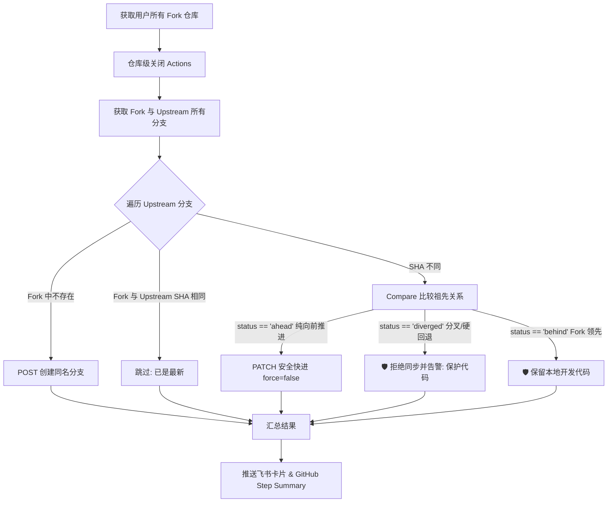

# GitHub Forks Auto Sync & Management (全量/全分支/安全防丢/飞书通知)

自动同步 GitHub 账号下所有 Fork 仓库的所有分支（包括上游新增分支），自动禁用 Fork 仓库的 GitHub Actions，并在执行完成后向飞书机器人发送卡片通知。

---

## ✨ 核心特性

- 🔄 **全量自动扫描**：自动分页扫描当前账号下**所有** Fork 仓库，无需手动配置仓库列表。
- 🌿 **全分支同步**：
  - **上游新增分支**：自动在 Fork 仓库中创建同名分支，跟随上游。
  - **已有分支更新**：严格进行 **Fast-Forward 安全校验**，仅在安全向前推进时更新。
- 🛡️ **防代码丢失保护**：
  - 若上游作者发生 **Force Push / Hard Reset（硬回退）** 或历史重写，系统**自动拒绝同步并告警**，绝不强制覆盖！
  - 若您在 Fork 仓库中有自己独有的提交（Diverged / Ahead），自动跳过同步，保护您的开发成果。
  - 若上游仓库/分支被删除（404/422），优雅跳过并标记。
- 🚫 **自动禁用 Actions**：一键在仓库级别禁用每个 Fork 仓库的 GitHub Actions（`enabled: false`），彻底避免消耗 Actions 运行额度及误跑 CI/CD。
- 📨 **飞书机器人通知**：运行完成后自动推送精美的**飞书交互式消息卡片 (Interactive Card)**，包含同步汇总及异常/跳过明细（支持签名校验）。
- 📊 **Actions 概况报告**：自动在 GitHub Actions 运行页面生成 Markdown Step Summary 统计表格。
- ⚙️ **黑/白名单过滤**：支持指定排除（`EXCLUDE_REPOS`）或仅同步特定仓库（`INCLUDE_ONLY`）。

---

## 🚀 部署与使用指南 (GitHub Actions 零服务器部署)

### 步骤 1：创建并配置 GitHub Personal Access Token (PAT)

由于需要访问和更新您账号下的所有 Fork 仓库并设置 Actions 权限，需要创建一个 PAT：

1. 登录 GitHub，点击右上角头像 -> **Settings** -> **Developer Settings** -> **Personal access tokens** -> **Tokens (classic)**。
2. 点击 **Generate new token (classic)**。
3. 勾选权限：
   - `repo`（完整控制私有与公开仓库、读写分支、Commit）
   - `workflow`（更新工作流）
   - `admin:repo_hook`（或具备修改仓库 Settings 权限）
4. 点击 **Generate token** 并复制保存 Token（例如：`ghp_xxxx`）。

---

### 步骤 2：在本项目仓库中配置 GitHub Secrets

将本项目代码推送到您的 GitHub 私有或公开仓库中，进入仓库页面：
1. 点击 **Settings** -> **Secrets and variables** -> **Actions**。
2. 在 **Repository secrets** 中点击 **New repository secret**，添加以下密钥：

| Secret 变量名 | 是否必填 | 说明 |
| :--- | :--- | :--- |
| `GH_PAT` | **必填** | 步骤 1 生成的 GitHub PAT（Classic 勾选 repo） |
| `FEISHU_WEBHOOK_URL` | 选填 | 飞书自定义机器人的 Webhook 地址 |
| `FEISHU_SECRET` | 选填 | 飞书机器人的安全设置签名校验密钥（若开启） |
| `DEBUG_MODE` | 选填 | 默认为 `false`（隐私保护模式，公有仓库隐藏具体仓库名）。设为 `true` 则在 Actions Summary 中展示明细表格 |

> **提示（可选环境变量）**：
> 如果需要排除特定仓库，可以在 **Variables**（仓库变量）中添加：
> - `EXCLUDE_REPOS`: `repo-name-1,owner/repo-name-2`（逗号分隔）
> - `INCLUDE_ONLY`: `repo-name-3`（仅同步指定的仓库）

---

### 步骤 3：配置飞书自定义机器人（可选）

1. 在飞书群组中，点击右上角 **设置** -> **机器人** -> **添加机器人** -> 选择 **自定义机器人**。
2. 设置机器人名称（例如：`GitHub 同步助手`）。
3. 复制生成的 **Webhook 地址** 并填入 GitHub Secret `FEISHU_WEBHOOK_URL`。
4. （可选）勾选 **签名校验**，复制密钥并填入 GitHub Secret `FEISHU_SECRET`。

---

### 步骤 4：运行与定时调度

- **定时自动运行**：已配置为每周日 **03:23 UTC（北京时间每周日 11:23）** 自动运行一次（`23 3 * * 0`），避开整点高峰期排队拥堵，几乎秒级响应执行。
- **Star 快捷触发**：支持 **点亮仓库右上角 Star ⭐** 立即触发执行（仅限仓库所有者点亮生效）。
- **永久防停用心跳 (Keep-Alive)**：已内置 `.github/workflows/keepalive.yml`，每半个月自动提交一次心跳记录，**彻底免去 60 天无提交被 GitHub 暂停定时任务的烦恼**，永久无需人工维护！
- **手动界面触发**：
  1. 进入仓库的 **Actions** 页面。
  2. 点击左侧的 **Auto Sync Forks & Disable Actions** 工作流。
  3. 点击右侧 **Run workflow** 按钮即可一键立即执行。

#### ⏰ 如何修改定时频率？
打开 [`.github/workflows/sync_forks.yml`](.github/workflows/sync_forks.yml) 文件，修改 `cron: '...'` 一行：

| 想要运行的频率 | Cron 表达式 | 说明（已做错峰优化） |
| :--- | :--- | :--- |
| **每周日一次（当前默认）** | `'23 3 * * 0'` | 每周日 03:23 UTC（北京时间每周日 11:23） |
| **每周一和周五各一次** | `'23 3 * * 1,5'` | 每周一、周五各运行一次 |
| **每 3 天运行一次** | `'23 3 */3 * *'` | 每隔 3 天运行一次 |
| **每天运行一次** | `'23 3 * * *'` | 每天固定北京时间 11:23 运行 |
| **每 6 小时运行一次** | `'23 */6 * * *'` | 每 6 小时运行一次 |
| **每月 1 号运行一次** | `'23 3 1 * *'` | 每月 1 号运行一次 |

---

## 🛠️ 本地运行与调试

如果您想在本地电脑运行脚本：

```bash
# 1. 安装依赖
pip install -r requirements.txt

# 2. 设置环境变量并运行
export GH_PAT="ghp_your_personal_access_token"
export FEISHU_WEBHOOK_URL="https://open.feishu.cn/open-apis/bot/v2/hook/xxxx"
# export FEISHU_SECRET="your_secret"

python -m src.main
```

Windows PowerShell:
```powershell
$env:GH_PAT="ghp_your_personal_access_token"
$env:FEISHU_WEBHOOK_URL="https://open.feishu.cn/open-apis/bot/v2/hook/xxxx"
python -m src.main
```

---

## 🛡️ 安全与防护逻辑说明


